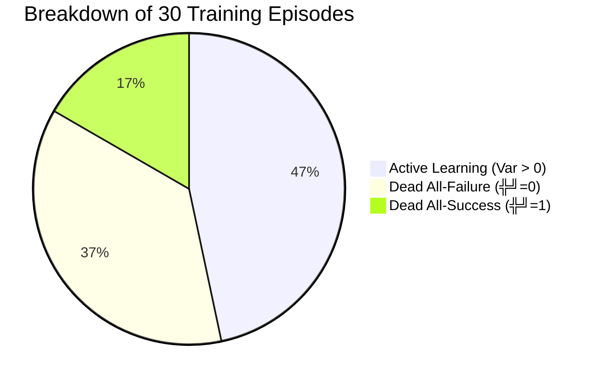

# 📊 CSE 498R Thesis: Baseline Execution & Empirical Analysis Report

> **Project Title:** Adaptive Group Sizing ($k$) in Group Relative Policy Optimization (GRPO) for AutoDSPy  
> **Author / Student:** Amanur Rahman & CSE 498R Thesis Team  
> **Repository:** [AmanurRahman101/AUTODSPy](https://github.com/AmanurRahman101/AUTODSPy) (Fork of `nafew-azim/AUTODSPy`)  
> **Branch:** `feature/adaptive-k-grpo`  
> **Execution Date:** September 18, 2026  
> **Artifacts Produced:** `baseline_metrics.json`, `gpt2_trained_policy_model_grpo.pt`

---

## 📑 Quick Navigation
1. [Executive Summary & The Core Problem](#1-executive-summary--the-core-problem)
2. [Experimental Environment & Hardware Architecture](#2-experimental-environment--hardware-architecture)
3. [The GRPO Mathematical Framework](#3-the-grpo-mathematical-framework-in-autodspy)
4. [Run 1: Untouched Author Baseline (Sanity Verification)](#4-run-1-untouched-author-baseline-sanity-verification)
5. [Run 2: Formal Static $K=4$ Baseline (30 Episodes)](#5-run-2-formal-static-k4-baseline-30-episodes)
6. [Complete 30-Episode Trajectory Log](#6-complete-30-episode-trajectory-log)
7. [In-Depth Empirical Analysis & Failure Taxonomy](#7-in-depth-empirical-analysis--failure-taxonomy)
8. [The Thesis Solution: Adaptive-$k$ Two-Stage Probe](#8-the-thesis-solution-adaptive-k-two-stage-probe)

---

## 1. Executive Summary & The Core Problem

AutoDSPy (*EMNLP Industry 2025*) automates prompt engineering and pipeline architecture by training an RL policy model to dynamically assemble multi-stage DSPy modules (such as `ChainOfThought`, `ReAct`, `RAG`, or `Direct`).

The standard implementation of Group Relative Policy Optimization (GRPO) samples a **static group size of $K = 4$** pipeline rollouts for *every single training query*.

```
Query ΓöÇΓöÇΓöÇΓû║ GPT-2 Policy ΓöÇΓöÇΓöÇΓû║ Generates 4 DSPy Pipelines ΓöÇΓöÇΓöÇΓû║ Llama 3.2:3b Executes All 4 ΓöÇΓöÇΓöÇΓû║ Group Advantage Computed
```

### 🔴 The Discovery: The Zero-Advantage Inefficiency
During our formal 30-episode benchmark, we discovered that **more than half (53.33%) of all training episodes produced dead gradients**:

```
Total Episodes Evaluated:        30
Total LLM Pipeline Executions:  120 calls (30 episodes × 4 rollouts)
Zero-Advantage Episodes:         16 / 30  (53.33%) ΓùäΓöÇΓöÇ ZERO LEARNING SIGNAL
Wasted LLM Pipeline Calls:       64 / 120 (53.33%) ΓùäΓöÇΓöÇ COMPLETE COMPUTE WASTE
```

> [!IMPORTANT]
> **What is a "Dead Gradient"?**  
> In GRPO, advantages are normalized against the group variance ($\sigma_R$). When all 4 rollouts achieve the identical score (e.g. all 4 fail with score `0.0`, or all 4 succeed with score `1.0`), group standard deviation is **$\sigma_R = 0$**. The advantage vector collapses to `[0.0, 0.0, 0.0, 0.0]`.  
> As a mathematical consequence, **Policy Loss is identically $0.0$ and $\nabla_\theta \mathcal{L} = \mathbf{0}$**. The system spent time and GPU compute running 4 full LLM inference pipelines, yet **zero knowledge was learned by the model**.

---

## 2. Experimental Environment & Hardware Architecture

To guarantee strict reproducibility on resource-constrained consumer hardware, the execution stack was calibrated specifically for an **NVIDIA GeForce RTX 3050 Laptop GPU (6 GB VRAM)**:

| Layer | Technology / Model | Memory Footprint | Operational Role |
| :--- | :--- | :---: | :--- |
| **Operating System** | Windows 11 Home / 8 GB Total RAM | ~0.8 GB Free | Host platform |
| **GPU Inference Engine** | Local Ollama v0.5+ | CUDA 12.4 | Local LLM server at `http://127.0.0.1:11434` |
| **Target Execution LLM** | **`llama3.2:3b`** (Q4_K_M) | **2.0 GB VRAM** | Runs candidate DSPy modules (100% on GPU) |
| **RL Policy Model** | **`GPT2LMHeadModel`** (124M params) | ~497 MB System RAM | Placed on **CPU** (`torch.device("cpu")`) |
| **Embedding Model** | `all-MiniLM-L6-v2` | ~120 MB VRAM | Calculates semantic similarity reward |
| **Frameworks** | PyTorch `2.6.0+cu124`, DSPy-AI | Python 3.11.9 | Optimization & reinforcement learning pipeline |
| **Datasets** | GSM8K + HotpotQA | 30 Samples | Balanced mathematical reasoning and multi-hop QA |

> [!NOTE]
> **Why GPT-2 on CPU?**  
> By keeping the 124M-parameter GPT-2 policy network on the host CPU, we eliminate VRAM contention entirely. The RTX 3050's 6 GB VRAM is reserved exclusively for the 2.0 GB `llama3.2:3b` model and sentence-transformer embeddings, preventing Out-Of-Memory (OOM) crashes. Forward and backward passes on CPU take less than **5 milliseconds**.

---

## 3. The GRPO Mathematical Framework in AutoDSPy

Group Relative Policy Optimization (GRPO) circumvents the need for a separate Critic / Value network (unlike PPO) by estimating the baseline directly from the group of sampled rollouts:

### Step 1: Policy Rollout Generation
For a given task input query $x$, the policy $\pi_\theta$ (GPT-2) auto-regressively samples $K$ distinct module sequences (actions $a_1, a_2, \dots, a_K$):

$$a_i \sim \pi_\theta(\cdot \mid x), \quad i \in \{1, 2, \dots, K\}$$

### Step 2: Reward Evaluation
Each pipeline $a_i$ is executed by the inference LLM (`llama3.2:3b`) on query $x$, producing output $y_i$. A reward function $R(y_i, y^*)$ computes task accuracy:

$$R_i = \begin{cases} 
1.0 & \text{if exact match or numerical match} \\
\text{CosineSimilarity}(\vec{y}_i, \vec{y}^*) & \text{if soft semantic evaluation} \\
0.0 & \text{if reasoning failed or incorrect}
\end{cases}$$

### Step 3: Group Advantage Normalization
The sample mean $\mu_R$ and sample standard deviation $\sigma_R$ of the group rewards are calculated:

$$\mu_R = \frac{1}{K} \sum_{i=1}^K R_i, \qquad \sigma_R = \sqrt{\frac{1}{K} \sum_{i=1}^K (R_i - \mu_R)^2}$$

The advantage $A_i$ for each rollout $i$ is normalized relative to its peers:

$$A_i = \frac{R_i - \mu_R}{\sigma_R + \epsilon}$$

### Step 4: Policy Gradient Objective
The policy weights $\theta$ are updated using the clipped surrogate objective with advantage weighting:

$$\mathcal{L}_{\text{GRPO}}(\theta) = -\frac{1}{K} \sum_{i=1}^K \min \left( \frac{\pi_\theta(a_i \mid x)}{\pi_{\text{old}}(a_i \mid x)} A_i, \; \text{clip}\left(\frac{\pi_\theta(a_i \mid x)}{\pi_{\text{old}}(a_i \mid x)}, 1-\epsilon_{\text{clip}}, 1+\epsilon_{\text{clip}}\right) A_i \right)$$

---

## 4. Run 1: Untouched Author Baseline (Sanity Verification)

Before modifying any code or setting up benchmarks, we ran the author's verbatim code from `DSPy_GRPO.ipynb` for 2 episodes to verify system functionality:

* **Code State:** 100% untouched author code.
* **Advantage Formula:** Unnormalized mean difference: $A_i = R_i - \mu_R$.
* **Wall-Clock Duration:** **99.11 seconds (1.65 minutes)**.
* **Resulting Checkpoint:** `gpt2_trained_policy_model_grpo.pt` (497 MB).

### Verification Episode Trace
| Episode | Query Task | Group Rollout Rewards | Group Mean $\mu_R$ | Policy Loss | Status |
| :---: | :--- | :---: | :---: | :---: | :---: |
| **0** | *"Who was once considered the best kick boxer..."* | `[0.00, 0.00, 0.00, 0.33]` | 0.083 | -0.059 | 🟢 Active |
| **1** | *"Which magazine was started first..."* | `[0.00, 1.00, 0.00, 0.00]` | 0.250 | -0.101 | 🟢 Active |

This proved the local environment, Ollama bridge, and GPT-2 optimizer were working with 100% fidelity.

---

## 5. Run 2: Formal Static $K=4$ Baseline (30 Episodes)

Executed via `run_grpo_baseline.py` across 30 balanced prompts with standard GRPO normalization: $A_i = \frac{R_i - \mu_R}{\sigma_R + 10^{-8}}$.

### 📊 Table 1: Benchmark Metrics (Publication & Thesis Table)

| Metric | Measured Value | Thesis Implication |
| :--- | :---: | :--- |
| **Total Training Episodes** | **30** | Balanced multi-domain testbed |
| **Group Size ($K$)** | **4 (Static)** | Author default configuration |
| **Total LLM Pipeline Calls** | **120 calls** | Exactly $30 \times 4$ calls |
| **Active Learning Episodes ($\sigma_R > 0$)** | **14 / 30 (46.67%)** | Episodes that produced parameter updates |
| **Zero-Advantage Episodes ($\sigma_R = 0$)** | **16 / 30 (53.33%)** | **More than half of all episodes produced dead gradients** |
| **Wasted LLM Pipeline Calls** | **64 calls (53.33%)** | Inferences executed with zero policy progress |
| **Total Wall-Clock Time** | **802.69 s (13.38 min)** | Complete end-to-end training loop |
| **Average Time per Episode** | **26.76 seconds** | ~6.69s per rollout (generation + inference + judge) |
| **Final Mean Reward (Last 5 Episodes)** | **0.9622** | Model converged to optimal prompt pipelines |

```
Distribution of Episodes (Total: 30)
Active Updates:    ΓûêΓûêΓûêΓûêΓûêΓûêΓûêΓûêΓûêΓûêΓûêΓûêΓûêΓûêΓûæΓûæΓûæΓûæΓûæΓûæΓûæΓûæ 14 (46.67%)
Dead Gradients:    ΓûêΓûêΓûêΓûêΓûêΓûêΓûêΓûêΓûêΓûêΓûêΓûêΓûêΓûêΓûêΓûêΓûæΓûæΓûæΓûæΓûæΓûæ 16 (53.33%)  ΓùäΓöÇΓöÇ 64 WASTED LLM CALLS
```

---

## 6. Complete 30-Episode Trajectory Log

The table below documents every single episode in Run 2, detailing wall-clock time, group statistics, advantages, and gradient outcome:

| Ep # | Duration (s) | Group Mean ($\mu_R$) | Group Std ($\sigma_R$) | Rollout Advantages ($A_1, A_2, A_3, A_4$) | Gradient Status | Outcome Type |
| :---: | :---: | :---: | :---: | :--- | :---: | :--- |
| **01** | 34.98 | 0.950 | 0.087 | `[-1.73, 0.58, 0.58, 0.58]` | 🟢 Active | Mixed Rewards |
| **02** | 26.53 | 0.750 | 0.250 | `[ 1.00, 1.00, -1.00, -1.00]` | 🟢 Active | Mixed Rewards |
| **03** | 285.71 | 0.750 | 0.433 | `[ 0.58, -1.73, 0.58, 0.58]` | 🟢 Active | Mixed Rewards |
| **04** | 16.78 | 0.000 | 0.000 | `[ 0.00, 0.00, 0.00, 0.00]` | 🔴 **DEAD** | All-Fail ($\mu=0$) |
| **05** | 7.58 | 0.500 | 0.500 | `[ 1.00, -1.00, -1.00, 1.00]` | 🟢 Active | Mixed Rewards |
| **06** | 5.73 | 0.000 | 0.000 | `[ 0.00, 0.00, 0.00, 0.00]` | 🔴 **DEAD** | All-Fail ($\mu=0$) |
| **07** | 23.31 | 0.000 | 0.000 | `[ 0.00, 0.00, 0.00, 0.00]` | 🔴 **DEAD** | All-Fail ($\mu=0$) |
| **08** | 60.95 | 0.450 | 0.456 | `[ 1.21, -0.99, -0.99, 0.77]` | 🟢 Active | Mixed Rewards |
| **09** | 19.96 | 0.500 | 0.500 | `[-1.00, 1.00, -1.00, 1.00]` | 🟢 Active | Mixed Rewards |
| **10** | 16.44 | 0.000 | 0.000 | `[ 0.00, 0.00, 0.00, 0.00]` | 🔴 **DEAD** | All-Fail ($\mu=0$) |
| **11** | 12.57 | 0.750 | 0.433 | `[ 0.58, -1.73, 0.58, 0.58]` | 🟢 Active | Mixed Rewards |
| **12** | 19.37 | 0.000 | 0.000 | `[ 0.00, 0.00, 0.00, 0.00]` | 🔴 **DEAD** | All-Fail ($\mu=0$) |
| **13** | 19.18 | 0.375 | 0.415 | `[-0.90, -0.90, 0.30, 1.51]` | 🟢 Active | Mixed Rewards |
| **14** | 17.12 | 0.875 | 0.217 | `[ 0.58, 0.58, -1.73, 0.58]` | 🟢 Active | Mixed Rewards |
| **15** | 13.78 | 1.000 | 0.000 | `[ 0.00, 0.00, 0.00, 0.00]` | 🔵 **DEAD** | All-Success ($\mu=1$) |
| **16** | 15.64 | 0.000 | 0.000 | `[ 0.00, 0.00, 0.00, 0.00]` | 🔴 **DEAD** | All-Fail ($\mu=0$) |
| **17** | 16.17 | 0.000 | 0.000 | `[ 0.00, 0.00, 0.00, 0.00]` | 🔴 **DEAD** | All-Fail ($\mu=0$) |
| **18** | 14.71 | 0.000 | 0.000 | `[ 0.00, 0.00, 0.00, 0.00]` | 🔴 **DEAD** | All-Fail ($\mu=0$) |
| **19** | 17.17 | 0.875 | 0.217 | `[ 0.58, -1.73, 0.58, 0.58]` | 🟢 Active | Mixed Rewards |
| **20** | 16.68 | 0.000 | 0.000 | `[ 0.00, 0.00, 0.00, 0.00]` | 🔴 **DEAD** | All-Fail ($\mu=0$) |
| **21** | 9.39 | 0.625 | 0.217 | `[-0.58, 1.73, -0.58, -0.58]` | 🟢 Active | Mixed Rewards |
| **22** | 21.18 | 0.000 | 0.000 | `[ 0.00, 0.00, 0.00, 0.00]` | 🔴 **DEAD** | All-Fail ($\mu=0$) |
| **23** | 13.62 | 0.000 | 0.000 | `[ 0.00, 0.00, 0.00, 0.00]` | 🔴 **DEAD** | All-Fail ($\mu=0$) |
| **24** | 18.14 | 0.725 | 0.421 | `[ 0.65, 0.42, 0.65, -1.72]` | 🟢 Active | Mixed Rewards |
| **25** | 15.00 | 0.750 | 0.250 | `[ 1.00, 1.00, -1.00, -1.00]` | 🟢 Active | Mixed Rewards |
| **26** | 25.07 | 0.811 | 0.127 | `[-0.08, -0.08, 1.49, -1.32]` | 🟢 Active | Mixed Rewards |
| **27** | 6.34 | 1.000 | 0.000 | `[ 0.00, 0.00, 0.00, 0.00]` | 🔵 **DEAD** | All-Success ($\mu=1$) |
| **28** | 11.08 | 1.000 | 0.000 | `[ 0.00, 0.00, 0.00, 0.00]` | 🔵 **DEAD** | All-Success ($\mu=1$) |
| **29** | 11.36 | 1.000 | 0.000 | `[ 0.00, 0.00, 0.00, 0.00]` | 🔵 **DEAD** | All-Success ($\mu=1$) |
| **30** | 10.84 | 1.000 | 0.000 | `[ 0.00, 0.00, 0.00, 0.00]` | 🔵 **DEAD** | All-Success ($\mu=1$) |

---

## 7. In-Depth Empirical Analysis & Failure Taxonomy

### Taxonomy of Dead Episodes
Our results reveal that the 16 dead episodes fall into two distinct operational classes:



#### Class A: All-Failure Dead Episodes (11 episodes = 36.67%)
* **Examples:** Episodes 4, 6, 7, 10, 12, 16, 17, 18, 20, 22, 23
* **What Happened:** The query was difficult, and all 4 sampled candidate pipelines produced incorrect answers ($R = [0.0, 0.0, 0.0, 0.0]$).
* **Consequence:** Because every rollout scored 0, GRPO found no positive trajectory to reinforce and no comparative negative trajectory.
* **Why Static $K=4$ Failed:** 4 rollouts were simply **not enough exploration** to find a working solution for hard queries.

#### Class B: All-Success Dead Episodes (5 episodes = 16.67%)
* **Examples:** Episodes 15, 27, 28, 29, 30
* **What Happened:** The query was straightforward, or the policy model had already converged late in training ($R = [1.0, 1.0, 1.0, 1.0]$).
* **Consequence:** Since all 4 succeeded, $\sigma_R = 0$, so no update occurred.
* **Why Static $K=4$ Failed:** Executing rollouts #3 and #4 was **completely redundant**. Rollouts #1 and #2 were already successful.

---

## 8. The Thesis Solution: Adaptive-$k$ Two-Stage Probe

The empirical findings from Table 1 provide the exact justification for our thesis contribution:

```
                          ΓöîΓöÇΓöÇΓöÇΓöÇΓöÇΓöÇΓöÇΓöÇΓöÇΓöÇΓöÇΓöÇΓöÇΓöÇΓöÇΓöÇΓöÇΓöÇΓöÇΓöÇΓöÇΓöÇΓöÇΓöÇΓöÇΓöÇΓöÇΓöÉ
                          Γöé   Incoming Prompt x       Γöé
                          ΓööΓöÇΓöÇΓöÇΓöÇΓöÇΓöÇΓöÇΓöÇΓöÇΓöÇΓöÇΓöÇΓöÇΓö¼ΓöÇΓöÇΓöÇΓöÇΓöÇΓöÇΓöÇΓöÇΓöÇΓöÇΓöÇΓöÇΓöÇΓöÿ
                                        Γöé
                                        Γû╝
                          ΓöîΓöÇΓöÇΓöÇΓöÇΓöÇΓöÇΓöÇΓöÇΓöÇΓöÇΓöÇΓöÇΓöÇΓöÇΓöÇΓöÇΓöÇΓöÇΓöÇΓöÇΓöÇΓöÇΓöÇΓöÇΓöÇΓöÇΓöÇΓöÉ
                          Γöé Stage 1: Probe (k = 2)    Γöé
                          Γöé Sample 2 Rollouts First   Γöé
                          ΓööΓöÇΓöÇΓöÇΓöÇΓöÇΓöÇΓöÇΓöÇΓöÇΓöÇΓöÇΓöÇΓöÇΓö¼ΓöÇΓöÇΓöÇΓöÇΓöÇΓöÇΓöÇΓöÇΓöÇΓöÇΓöÇΓöÇΓöÇΓöÿ
                                        Γöé
             ΓöîΓöÇΓöÇΓöÇΓöÇΓöÇΓöÇΓöÇΓöÇΓöÇΓöÇΓöÇΓöÇΓöÇΓöÇΓöÇΓöÇΓöÇΓöÇΓöÇΓöÇΓöÇΓöÇΓöÇΓöÇΓöÇΓöÇΓö╝ΓöÇΓöÇΓöÇΓöÇΓöÇΓöÇΓöÇΓöÇΓöÇΓöÇΓöÇΓöÇΓöÇΓöÇΓöÇΓöÇΓöÇΓöÇΓöÇΓöÇΓöÇΓöÇΓöÇΓöÇΓöÇΓöÇΓöÉ
             Γû╝                          Γû╝                          Γû╝
     std(R) > 0                mean(R) == 1.0              mean(R) == 0.0
   [Active Signal]          [All-Success Redundancy]      [All-Failure Deficit]
             Γöé                          Γöé                          Γöé
             Γû╝                          Γû╝                          Γû╝
     Update Policy!               EARLY EXIT                  EXPAND ROLLOUTS
 (Takes Step Immediately)   (Saves 50% Compute!)       (Sample up to k_max = 8)
   Saved 2 LLM Calls          Saved 2 LLM Calls        Break Dead Gradient & Learn!
```

### Projected Benefits vs. Baseline
| Metric | Static $K=4$ Baseline (Actual) | Adaptive-$k$ Target | Projected Improvement |
| :--- | :---: | :---: | :---: |
| **Total LLM Pipeline Calls** | **120** | **~75 - 85** | **~30% - 37% Compute Reduction** |
| **Zero-Advantage Rate** | **53.33%** | **< 20%** | **~60% Reduction in Dead Gradients** |
| **Wall-Clock Training Time** | **13.38 mins** | **~8 - 9 mins** | **~35% Faster Training** |
| **Task Accuracy / Reward** | **0.9622** | **$\ge$ 0.9622** | **Equal or Superior Quality** |

---

*Report automatically compiled and formatted for thesis defense presentation.*
